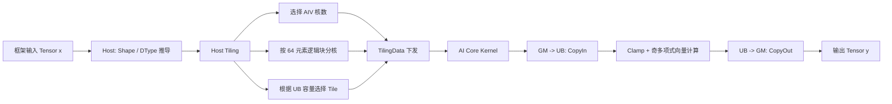

# Ascend C ERF 算子：项目实现详解与针对性面试问答

> 项目：华为算法挑战赛——CANN 算子挑战赛  
> 角色：团队队长  
> 代码目录：[Erf](./Erf/)  
> 岗位方向：大模型训练推理算子、算子性能与精度优化、Ascend C / Triton / TileLang、自动算子生成  
> 生成日期：2026-06-20

## 阅读说明与事实边界

本文基于以下真实材料展开：

- [Host 侧算子定义与 Tiling](./Erf/op_host/erf.cpp)
- [AI Core Kernel](./Erf/op_kernel/erf.cpp)
- [Tiling 数据结构](./Erf/op_kernel/erf_tiling.h)
- [Tiling Key](./Erf/op_kernel/tiling_key_erf.h)
- 简历截图中的项目描述
- 已整理的华为、海思、AI Infra 和算子岗面经

以下内容需要在正式面试前用你的原始材料补齐，不能临场编造：

- 多项式系数的具体拟合工具、目标函数、采样点和生成过程。当前仓库只保存了系数，没有拟合脚本。
- “性能提升 1.8 倍以上”的硬件型号、软件版本、输入 Shape、基线核数、计时口径、预热次数和统计结果。当前仓库没有 Profiling 报告。
- 团队人数、任务分工、比赛名次、开发周期和个人提交量。

本文对多项式误差的数值分析，是使用源码中的系数独立计算得到的辅助结果，不等同于比赛官方精度报告；实际 FP32 Kernel 结果会存在额外舍入误差。

当前工作区未提供可运行的 CANN/昇腾设备环境，因此本文完成的是源码级实现还原和独立数值分析，没有重新编译、上板或复现 1.8 倍性能结果。

---

# 1. 项目一句话定位

在昇腾 NPU 上使用 Ascend C 实现 FP32 ERF 特殊函数算子：Host 侧根据输入规模、AI Core 数量和 UB 容量动态生成多核及 Tile 策略；Kernel 侧通过区间裁剪、九阶奇多项式近似、全向量化、TPipe 双缓冲和 DataCopyPad 尾块处理，实现精度与性能的折中。

# 2. 两分钟项目介绍

可直接用于面试，但请补上方括号内的真实数据：

> 这个项目来自华为 CANN 算子挑战赛，我担任团队队长，负责 ERF 算子的公式优化、Ascend C 开发、正确性测试和性能调优。  
>  
> ERF 是误差函数，精确形式包含积分，不能直接用有限次基础算术高效求值，而且它还是精确 GELU 激活函数的重要组成部分。我们的实现采用 Host Tiling 加 AI Core Kernel 的架构。Host 侧读取输入元素数、AIV 核数和 UB 容量，根据 Shape 动态选择 1 核、20 核、32 核或全部可用核，并计算每核数据块和 Tile 长度。Kernel 侧把 GM 数据分块搬入 UB，使用 TPipe 的双输入、双输出 Buffer 形成 CopyIn、Compute、CopyOut 流水。  
>  
> 数学上先把输入裁剪到 `[-2.25, 2.25]`，再计算九阶奇多项式 `x(c0+c1x²+c2x⁴+c3x⁶+c4x⁸)`，这样既保持 ERF 的奇函数性质，又避免多项式在大输入处发散。实现中所有主要步骤都使用向量指令，并用 Axpy 合并一组乘加；尾块根据 32 字节对齐情况选择 DataCopy 或 DataCopyPad。  
>  
> 性能方面，项目通过自适应核数避免小 Shape 多核启动成本，通过 UB 容量计算 Tile 并启用双缓冲；相对 `[固定核数基线]`，在 `[硬件、Shape 集和计时口径]` 下取得 `[真实性能数据]`。后续如果继续优化，我会补齐自动调优、FP16/BF16 多类型、融合 GELU 和更完整的精度回归。

# 3. ERF 数学原理

## 3.1 ERF 是什么？

误差函数定义为：

```text
erf(x) = 2 / sqrt(π) · ∫[0,x] exp(-t²) dt
```

基本性质：

- `erf(0) = 0`
- `erf(-x) = -erf(x)`，是奇函数。
- 单调递增。
- `x → +∞` 时趋近 1，`x → -∞` 时趋近 -1。
- 导数：

```text
erf'(x) = 2 / sqrt(π) · exp(-x²)
```

ERF 与标准正态分布的累积分布函数有关：

```text
Φ(x) = 1/2 · [1 + erf(x / sqrt(2))]
```

## 3.2 ERF 与大模型有什么关系？

精确 GELU 激活函数为：

```text
GELU(x) = x · Φ(x)
        = 0.5x · [1 + erf(x / sqrt(2))]
```

因此 ERF 可作为精确 GELU 的基础算子。BERT 等 Transformer 模型广泛使用 GELU；部分现代大模型改用 SiLU/SwiGLU，因此不能说所有大模型都依赖 ERF，但该项目与“大模型核心激活算子、特殊函数算子和算子融合”方向高度相关。

进一步优化方向是将：

```text
x / sqrt(2) -> erf -> +1 -> ×0.5 -> ×x
```

融合为单个 GELU Kernel，避免中间张量落回 GM。

## 3.3 为什么不直接计算积分？

设备 Kernel 需要对大量元素高吞吐计算。直接数值积分会产生：

- 每个元素需要循环或自适应迭代。
- 不同输入可能迭代次数不同，造成分支和负载不均。
- 指令数量大。
- 难以向量化。

因此工业实现通常使用分段多项式、有理函数、查表或硬件数学指令近似。

# 4. 当前实现的精确数学表达式

源码中的系数为：

```text
c0 =  1.1241970062
c1 = -0.3571457863
c2 =  0.0879194960
c3 = -0.0123575451
c4 =  0.0007278307
```

首先裁剪：

```text
xc = clamp(x, -2.25, 2.25)
```

随后计算：

```text
P(xc) = xc · (c0
            + c1·xc²
            + c2·xc⁴
            + c3·xc⁶
            + c4·xc⁸)
```

这是一个九阶奇多项式：

```text
P(x) = c0x + c1x³ + c2x⁵ + c3x⁷ + c4x⁹
```

## 4.1 为什么设计成奇多项式？

ERF 是奇函数。写成：

```text
x · Q(x²)
```

天然保证：

```text
P(-x) = -P(x)
P(0) = 0
```

相比直接拟合一般九阶多项式，它：

- 不需要偶次项。
- 参数更少。
- 保留数学对称性。
- 正负输入精度天然对称。
- 计算中可以复用 `x²`、`x⁴`。

## 4.2 为什么裁剪到 `[-2.25, 2.25]`？

多项式只在有限区间内拟合良好，区间外高次项会快速增大。ERF 在 `|x|` 较大时已经接近 ±1，因此将输入裁剪：

- 防止高次多项式在大输入处发散。
- 固定近似的有效区间。
- 不需要针对极端输入增加复杂分支。
- 可直接使用向量 `Mins` 和 `Maxs`。

当前实现并不是直接把区间外输出设成 ±1，而是把输入设为 ±2.25 后计算多项式，因此区间外输出是常数：

```text
P(2.25)  ≈  0.9993367950
P(-2.25) ≈ -0.9993367950
```

## 4.3 独立误差分析

用源码中的十进制系数进行双精度独立计算：

| x | 当前多项式 | `math.erf(x)` | 误差 |
|---:|---:|---:|---:|
| 0.0 | 0.0000000000 | 0.0000000000 | 0 |
| 0.5 | 0.5201076423 | 0.5204998778 | -3.92e-4 |
| 1.0 | 0.8433410015 | 0.8427007929 | +6.40e-4 |
| 1.5 | 0.9654071672 | 0.9661051465 | -6.98e-4 |
| 2.0 | 0.9955351396 | 0.9953222650 | +2.13e-4 |
| 2.25 | 0.9993367950 | 0.9985372834 | +8.00e-4 |
| 3.0（被裁剪） | 0.9993367950 | 0.9999779095 | -6.41e-4 |

在 `[-2.25, 2.25]` 上密集采样得到：

- 最大绝对误差约 `8.0e-4`。
- RMS 误差约 `5.65e-4`。
- 多项式在该区间保持单调递增。

面试中应说明：

- 这是对保存系数的独立分析，不是 Kernel FP32 实测。
- 最终验收应使用比赛规定误差指标和测试集。
- 接近 0 时不宜只看相对误差。
- 还需测试 NaN、Inf、极值和不同 Shape。

## 4.4 当前系数是怎样得到的？

仓库中没有拟合脚本，因此最严谨回答是：

> 代码保留了最终低阶奇多项式系数，但当前材料不足以证明系数具体使用最小二乘、Remez 还是其他拟合方法生成。正式面试前我会找到原始拟合脚本或实验记录；如果重新完成，我会在目标区间拟合 `erf(x)/x` 关于 `x²` 的四次多项式，并以最大绝对误差、RMS 误差和单调性作为约束进行比较。

切勿把未经确认的系数来源说成“切比雪夫最优逼近”或“Remez”，面试官很容易继续追问推导。

# 5. 项目总体架构



代码分为：

- `op_host/erf.cpp`：算子定义、Shape/DType 推导、硬件查询和 Tiling。
- `op_kernel/erf.cpp`：AI Core Kernel、流水、向量计算和尾块处理。
- `erf_tiling.h`：Host 与 Kernel 共享的 Tiling 参数。
- `tiling_key_erf.h`：注册当前 FP32 编译实例。
- CMake 文件：生成 Tiling、ACLNN 调用和 Kernel 动态库并打包。

# 6. 算子注册与输入输出语义

算子注册部分声明：

```text
Input : x, REQUIRED, DT_FLOAT, FORMAT_ND
Output: y, REQUIRED, DT_FLOAT, FORMAT_ND
```

含义：

- 当前只支持 FP32。
- 输入输出为通用 ND 格式。
- ERF 是逐元素算子，因此输出 Shape 与输入完全一致。
- 输出数据类型与输入一致。

支持配置：

- `ascend910b`
- `ascend910_93`
- `ascend310p`

当前 `workspace = 0`，所有中间数据都放在每个 AI Core 的 UB Buffer 中。

# 7. Tiling 数据结构

```cpp
struct ErfTilingData {
    uint32_t totalLength;
    uint32_t blocksPerCore;
    uint32_t tailBlocks;
    uint32_t tileLength;
};
```

字段含义：

- `totalLength`：输入总元素数。
- `blocksPerCore`：每个核至少分到多少个逻辑块。
- `tailBlocks`：不能均分的额外逻辑块数量，分给前若干核。
- `tileLength`：单次 Copy/Compute 的元素数。

`ERF_ALIGN_ELEMENTS = 64` 表示调度使用 64 个 FP32 元素作为一个逻辑块，即 256 字节。注意：

- FP32 的 32 字节对齐只要求元素数是 8 的倍数。
- 这里选择 64，不只是满足最低对齐，而是用更大的逻辑块简化多核分配并降低碎片。

# 8. Host Tiling 实现逻辑

## 8.1 查询硬件资源

Host 侧通过 `PlatformAscendC`：

- 获取 AIV 可用核数。
- 预留 8 KB Local Memory。
- 查询每核 UB 大小。

若查询失败：

```text
numCores = 1
ubSize = 196608 bytes
```

这是防御式 Fallback，避免 Tiling 因平台信息异常直接产生零值。

## 8.2 空张量和极小张量

### 空张量

```text
totalLength = 0
blockDim = 1
blocksPerCore = 0
tailBlocks = 0
tileLength = 64
```

Kernel 初始化后发现 `coreDataSize_ == 0`，直接返回。

### `totalLength <= 64`

使用单核、一个逻辑块和 64 元素 Tile。实际复制时根据真实长度走尾块路径，不会读写 64 个有效元素。

## 8.3 总逻辑块数

```text
totalBlocks = ceil(totalLength / 64)
            = (totalLength + 63) / 64
```

最后一个逻辑块可以不满 64 个元素，Kernel 会根据 `totalLength` 截断。

## 8.4 自适应核数策略

源码实际策略为：

```text
N <= 49,152          -> 1 核
N <= 256 Ki elements -> min(20, 可用核数)
N <= 1 Mi elements   -> min(32, 可用核数)
更大                 -> 全部可用 AIV 核
```

随后还会约束：

```text
usedCoreNum <= totalBlocks
usedCoreNum >= 1
```

设计动机：

- 小 Shape 使用过多核，启动、调度和尾块成本可能大于并行收益。
- 中等 Shape 逐步增加核数。
- 大 Shape 使用全部可用核，提高并行度。

这些阈值是经验式 Dispatch。要证明合理，需要展示不同 Shape 下“核数—时延”曲线。

### 代码审查注意点

Host 中声明了：

```cpp
constexpr uint32_t kSmallSingleCoreThreshold = 16384;
```

但实际判断使用的是硬编码 `49152U`，该常量未被使用。面试官如果问代码质量，应主动承认：

> 这是调优后修改阈值时遗留的无效常量。应删除它，或者统一用命名常量表达所有分段阈值，避免实现和注释、实验配置不一致。

## 8.5 核间均匀分块

设：

```text
B = totalBlocks
C = usedCoreNum
q = floor(B / C)
r = B mod C
```

则：

- 前 `r` 个核处理 `q+1` 个逻辑块。
- 其余核处理 `q` 个逻辑块。

Kernel 对第 `coreId` 个核计算：

```text
startBlock = coreId·q + min(coreId, r)
myBlocks   = q + (coreId < r ? 1 : 0)
myOffset   = startBlock·64
myLength   = myBlocks·64
```

最后再根据 `totalLength` 截断最后一个核的实际长度。

该公式保证：

- 每个逻辑块只属于一个核。
- 核间无写冲突。
- 任意两核块数最多相差 1。
- 前缀偏移连续，没有空洞。

## 8.6 UB 容量与七份 Buffer

Kernel 为每个 Tile 分配：

- 输入队列 2 份。
- 输出队列 2 份。
- 临时 Buffer 3 份。

总计：

```text
2 + 2 + 3 = 7 份 float Tile
```

因此 Host 计算：

```text
maxTileLength = floor(UB bytes / (7 × sizeof(float)))
```

然后向下对齐到 2048 个元素：

```text
maxTileLength = AlignDown(maxTileLength, 2048)
```

在 Fallback UB = 196608 字节时：

```text
196608 / (7 × 4) ≈ 7021 elements
AlignDown(7021, 2048) = 6144 elements
```

实际七份 Tile 占用：

```text
7 × 6144 × 4 = 172032 bytes
```

再考虑预留的 8 KB，仍低于 196608 字节。

## 8.7 Tile 长度分档

先计算最大可能的单核长度：

```text
perCoreBlocks = blocksPerCore + (tailBlocks > 0 ? 1 : 0)
perCoreLength = perCoreBlocks × 64
```

选择：

```text
perCoreLength <= 64   -> tileLength = 64
perCoreLength <= 512  -> tileLength = 512
perCoreLength <= 2048 -> tileLength = 2048
perCoreLength <= 4096 -> tileLength = 4096
更大                  -> maxTileLength
```

最后：

```text
tileLength = min(tileLength, maxTileLength)
```

设计意图：

- 小输入不用分配过大 Tile。
- 大输入尽可能使用较大 Tile，降低循环和队列调度次数。
- Tile 不超过 UB 可容纳上限。
- 2048 元素对齐便于形成稳定的调度粒度。

该策略仍是规则式的，可进一步用 Autotuning 为不同芯片和 Shape 选择最佳 Tile。

# 9. Kernel 初始化逻辑

## 9.1 获取当前核编号

```cpp
const uint32_t coreId = AscendC::GetBlockIdx();
```

每个 AI Core 执行同一个 Kernel 程序，但通过 `coreId` 选择自己负责的数据区间。

## 9.2 计算本核区间

Kernel 使用 Host 下发的 `blocksPerCore` 和 `tailBlocks` 复原本核：

```text
startBlock
myBlocks
myOffset
myLength
```

若理论区间超过输入末尾：

```text
myLength = totalLength - myOffset
```

这一步把逻辑块长度转换为真实元素长度，确保最后一个核不会越界。

## 9.3 建立 GM 视图

```cpp
xGm_.SetGlobalBuffer(x + myOffset, coreDataSize_);
yGm_.SetGlobalBuffer(y + myOffset, coreDataSize_);
```

每个核的 `xGm_`、`yGm_` 都从自己的起始偏移开始，因此后续 Tile 内 Offset 可以从 0 计算。

## 9.4 初始化 TPipe Buffer

```text
inQueueX_:  2 × tileLength × FP32
outQueueY_: 2 × tileLength × FP32
tmpT_:      1 × tileLength × FP32
tmpT2_:     1 × tileLength × FP32
tmpQ1_:     1 × tileLength × FP32
```

队列的两份 Buffer 用于 Ping-Pong；三个临时 Buffer 保存平方、四次方和多项式分支。

# 10. TPipe、TQue、TBuf、GM 与 UB

## 10.1 GM

GM 是容量大的全局存储，输入和输出张量位于 GM。访问 GM 成本高，Kernel 应尽量：

- 连续、对齐地搬运。
- 每个元素只读一次、只写一次。
- 在 UB 中完成所有中间计算。

本算子对每个有效元素的理论 GM 流量约为：

```text
读 4 字节 + 写 4 字节 = 8 字节/元素
```

不含协议和对齐额外流量。

## 10.2 UB

UB 是 AI Core 的片上高速存储。容量小，但更适合向量计算。本实现把一个 Tile 的输入、输出和中间结果全部放入 UB。

## 10.3 TPipe

`TPipe` 管理 Kernel 内部流水所需的队列、Buffer 和事件依赖。开发者用 `AllocTensor / EnQue / DeQue / FreeTensor` 表达生产者—消费者关系，运行时可在满足依赖时重叠搬运和计算。

## 10.4 TQue

`TQue` 是流水阶段间的队列：

- `VECIN` 输入队列承接 GM→UB 的数据。
- `VECOUT` 输出队列承接计算结果，等待 UB→GM。

两级队列的生命周期：

```text
AllocTensor -> 写入 -> EnQue
DeQue -> 使用 -> FreeTensor
```

## 10.5 TBuf

`TBuf<VECCALC>` 是计算阶段独占的临时空间，不需要像输入输出那样跨流水阶段排队。

# 11. Process 流水的完整时序

设本核拥有：

```text
fullTileNum = coreDataSize / tileLength
tailCount   = coreDataSize % tileLength
```

## 11.1 本核不足一个完整 Tile

```text
CopyInTail
Compute(real_count)
CopyOutTail
```

只处理真实元素数，不计算 Padding 区。

## 11.2 有多个完整 Tile

源码先预取 Tile 0：

```text
CopyIn(Tile 0)
```

随后循环：

```text
CopyIn(Tile i)
Compute(Tile i-1)
CopyOut(Tile i-1)
```

逻辑流水：

```mermaid
gantt
    title 双缓冲流水示意
    dateFormat X
    axisFormat %s
    section CopyIn
    Tile0 :a0, 0, 2
    Tile1 :a1, 2, 2
    Tile2 :a2, 4, 2
    section Compute
    Tile0 :b0, 2, 3
    Tile1 :b1, 5, 3
    Tile2 :b2, 8, 3
    section CopyOut
    Tile0 :c0, 5, 2
    Tile1 :c1, 8, 2
    Tile2 :c2, 11, 2
```



图中的时间只是示意；实际重叠程度由指令依赖、硬件流水和运行时调度决定。

## 11.3 有尾 Tile

在最后一个完整 Tile 计算前，先把尾 Tile 搬入另一个输入 Buffer：

```text
CopyInTail(tail)
Compute(last full tile)
CopyOut(last full tile)
Compute(tailCount)
CopyOutTail(tailCount)
```

这样尾块搬运也有机会与最后完整块计算重叠。

## 11.4 无尾 Tile

循环结束后，队列中还剩最后一个完整 Tile：

```text
Compute(last tile)
CopyOut(last tile)
```

# 12. 32 字节对齐与 DataCopyPad

FP32 每元素 4 字节，因此：

```text
32 bytes / 4 bytes = 8 elements
```

判断：

```cpp
(count & 7U) == 0
```

即元素数是否是 8 的倍数。

## 12.1 对齐块

使用普通：

```cpp
DataCopy(dst, src, count)
```

## 12.2 非对齐尾块

使用：

```cpp
DataCopyPad(...)
```

输入方向按真实字节数从 GM 搬入 UB；输出方向只把真实字节数写回 GM。

## 12.3 为什么不能直接把尾块向上取整后 DataCopy？

直接多读、多写可能：

- 访问输入张量范围外的地址。
- 覆盖输出张量后续内存。
- 在严格内存检查下报错。

`DataCopyPad` 的意义是安全处理非对齐尾块，同时保留较高效的数据搬运。

## 12.4 Padding 元素会不会影响结果？

不会。尾块调用：

```text
Compute(tailCount)
```

向量计算只覆盖真实元素数，Padding 区不参与有效输出。

# 13. ComputeCore 逐指令还原

## 13.1 临时 Tensor 的语义

```text
xLocal     : 输入，裁剪后复用为 xc
xSquare    : z = xc²
xQuad      : z² = xc⁴
cubicPair  : 多项式高阶分支
yLocal     : 低阶分支与最终输出
```

这种复用避免额外 Buffer。

## 13.2 区间裁剪

```cpp
Mins(xSquare, xLocal,  2.25)
Maxs(xLocal,  xSquare, -2.25)
```

等价于：

```text
xSquare = min(x, 2.25)
xLocal  = max(xSquare, -2.25)
        = clamp(x, -2.25, 2.25)
```

这里先借用 `xSquare` 保存上界裁剪结果，随后 `xLocal` 被原地更新为最终裁剪值。

## 13.3 计算平方

```cpp
Mul(xSquare, xLocal, xLocal)
```

```text
z = xc²
```

## 13.4 低阶分支

```cpp
Muls(yLocal, xSquare, c1)
Adds(yLocal, yLocal, c0)
```

```text
low = c0 + c1·z
```

## 13.5 高阶分支初值

```cpp
Muls(cubicPair, xSquare, c3)
Adds(cubicPair, cubicPair, c2)
```

```text
high = c2 + c3·z
```

## 13.6 计算四次方

```cpp
Mul(xQuad, xSquare, xSquare)
```

```text
z² = xc⁴
```

## 13.7 Axpy 合并乘加

```cpp
Axpy(cubicPair, xQuad, c4)
```

语义：

```text
cubicPair = cubicPair + c4·xQuad
          = c2 + c3·z + c4·z²
```

它替代：

```text
tmp = c4·xQuad
cubicPair = cubicPair + tmp
```

收益可能包括：

- 少一条独立向量操作。
- 少一个中间 Tensor 或中间写回。
- 缩短依赖链和指令序列。

简历中不建议说“必然砍掉一个机器周期”，因为物理周期取决于芯片、编译结果、流水和数据规模。更严谨表述：

> 使用 Axpy 将 Muls+Add 的乘加序列合并，并通过 Profiling 验证 Kernel 时延下降 `[真实数据]`。

## 13.8 合并高阶项

```cpp
Mul(cubicPair, cubicPair, xQuad)
```

```text
high = (c2 + c3·z + c4·z²) · z²
     = c2·z² + c3·z³ + c4·z⁴
```

## 13.9 合并低阶和高阶

```cpp
Add(yLocal, yLocal, cubicPair)
```

```text
even_poly = c0 + c1·z + c2·z² + c3·z³ + c4·z⁴
```

## 13.10 恢复奇函数

```cpp
Mul(yLocal, yLocal, xLocal)
```

```text
y = xc · even_poly
```

得到最终九阶奇多项式。

# 14. 为什么没有直接使用标准 Horner 法？

标准 Horner 形式：

```text
P(x) = x · ((((c4z + c3)z + c2)z + c1)z + c0)
```

优点：

- 理论乘法数量较少。
- 临时变量少。

缺点：

- 依赖链很长，后一项必须等待前一项。
- 不利于同时展开两条向量计算链。

当前实现把多项式拆成：

```text
low  = c0 + c1z
high = (c2 + c3z + c4z²)z²
P    = x(low + high)
```

特点：

- `low` 与 `high` 可以形成较独立的计算。
- 显式复用 `z²`。
- `c4z² + high` 可用 Axpy。
- 可能更适合当前向量指令流水。

是否优于 Horner 不能只靠指令计数，需要在目标芯片上编译并比较：

- Kernel 时延。
- 指令流水 Stall。
- UB 读写。
- 临时 Buffer 和占用。

# 15. 性能模型与瓶颈分析

## 15.1 GM 流量

每个元素：

```text
1 次 FP32 读 + 1 次 FP32 写 ≈ 8 bytes
```

中间结果不写回 GM。

## 15.2 主要向量操作

每 Tile 大致包括：

- 2 次裁剪。
- 1 次平方。
- 2 次低阶乘加。
- 2 次高阶初始乘加。
- 1 次四次方。
- 1 次 Axpy。
- 1 次高阶乘法。
- 1 次分支求和。
- 1 次乘回 x。

虽然 GM 流量低，但多次中间 Tensor 读写发生在 UB，因此该算子可能受：

- 向量流水吞吐。
- UB 带宽。
- 指令依赖。
- 小 Shape Launch/调度。
- 大 Shape GM Copy。

中的一个或多个因素限制。不能仅因它是逐元素算子就直接断言“必然 GM 带宽受限”。

## 15.3 为什么自适应核数有效？

固定使用全部核对小 Shape 会导致：

- 每核数据过少。
- 多核启动和调度成本占比高。
- 尾块比例增大。
- 队列和流水来不及进入稳态。

固定使用少量核对大 Shape则并行度不足。分段核数策略在二者之间折中。

## 15.4 为什么大 Tile 不一定更快？

大 Tile：

- 循环次数少。
- 搬运粒度大。
- 数据处理更连续。

但也会：

- 占用更多 UB。
- 限制双缓冲或临时空间。
- 对短尾块产生浪费。
- 增加单 Tile 延迟。

因此 Tile 需要结合 UB、Shape 和流水进行调优。

## 15.5 “性能提升 1.8 倍”如何严谨证明？

必须给出：

```text
speedup = baseline_latency / optimized_latency
```

实验应固定：

- 芯片型号。
- CANN 和编译器版本。
- 输入 DType、Shape 和数据。
- 基线实现及固定核数。
- 预热次数。
- 重复执行次数。
- 同步与计时边界。
- 中位数或 P50/P90。
- 精度阈值。

建议表格：

| Shape | Baseline 核数 | 优化核数 | Baseline μs | 优化 μs | Speedup |
|---|---:|---:|---:|---:|---:|
| `[填写]` | `[填写]` | `[填写]` | `[填写]` | `[填写]` | `[填写]` |

如果只有部分 Shape 达到 1.8 倍，应写“最高 1.8 倍”或“在大 Shape 集合平均 `[x]` 倍”，不能写成所有场景都稳定 1.8 倍。

# 16. Profiling 应重点观察什么？

## 16.1 端到端

- 算子总时延。
- Host Tiling 和 Launch 开销。
- 是否有同步空洞。
- 多次调用时编译或初始化是否进入计时。

## 16.2 Kernel

- CopyIn、Compute、CopyOut 占比。
- 流水是否重叠。
- AIV 利用率。
- UB 使用量。
- 向量流水 Stall。
- 实际核数和每核时长。
- 最慢核是否由尾块或负载不均造成。

## 16.3 Shape 分桶

至少覆盖：

- 1、7、8、9、63、64、65 等边界。
- 核数分段阈值附近。
- Tile 长度分段附近。
- 极大 Shape。
- 不能被 8、64、TileLength 整除的 Shape。

# 17. 正确性与边界测试

## 17.1 基本功能

- 全零。
- 正负对称输入。
- 小数和随机数。
- `[-2.25, 2.25]` 内密集采样。
- 区间外大正、大负输入。

## 17.2 数学性质

- 奇函数：`y(-x) ≈ -y(x)`。
- 单调性。
- 输出范围接近 `[-1, 1]`。
- `x=0` 输出 0。

## 17.3 Shape 边界

- 空 Tensor。
- 元素数 `<8`。
- 8 的倍数和非倍数。
- 64 的倍数和非倍数。
- 小于一个 Tile。
- 正好一个 Tile。
- 多个 Tile 加尾块。
- 多核不能均分。

## 17.4 特殊值

- `+Inf/-Inf`：预期经过裁剪后输出饱和值，但必须以 Ascend C `Mins/Maxs` 对 Inf 的实际语义验证。
- `NaN`：必须验证指令是否传播 NaN；不能凭普通 C++ `min/max` 语义推断。
- 正负零。
- 最小正规数和次正规数。

## 17.5 精度指标

- 最大绝对误差。
- 平均绝对误差。
- RMS 误差。
- 相对误差，但避开参考值接近 0 的区域。
- ULP。
- 与框架参考 ERF 的逐点比较。

# 18. 当前实现的优点

- 保留 ERF 奇函数结构。
- 通过裁剪控制区间外发散。
- 全主要计算使用向量指令。
- 输入只从 GM 读取一次，输出只写一次。
- Host 根据 Shape 自适应核数。
- Tile 大小按 UB 容量计算。
- 双缓冲构建 Copy/Compute 流水。
- DataCopyPad 安全处理非对齐尾块。
- 核间分配差不超过一个逻辑块。
- 无外部 Workspace。
- 支持空 Tensor 和小 Shape。

# 19. 当前实现的局限与可改进点

## 19.1 只支持 FP32

岗位往往要求 FP16/BF16。可增加：

- 多 DType Tiling Key。
- 低精度输入、FP32 中间计算。
- 不同 DType 的对齐和 Tile 参数。
- 精度回归。

## 19.2 系数生成不可复现

应加入：

- 拟合脚本。
- 采样区间。
- 目标函数。
- 系数版本。
- 误差报告。

## 19.3 核数与 Tile 阈值是手工规则

可做：

- 自动调优。
- 按芯片型号维护策略。
- 代价模型。
- 首次运行搜索并缓存。

## 19.4 “Axpy 一个周期”的说法不够严谨

应改为基于编译结果和 Profile 的实测描述。

## 19.5 未使用常量

`kSmallSingleCoreThreshold` 未被使用，应清理或统一阈值命名。

## 19.6 元素总数使用 `uint32_t`

超大 Tensor 的元素数可能超过 32 位，应确认 CANN 接口和目标产品的上限，必要时使用 64 位并检查 Kernel 偏移类型。

## 19.7 尾块字节数转为 `uint16_t`

当前 Tile 上限下尾块字节数在安全范围内，但如果未来 UB 或 Tile 策略扩大，需要验证 `count * sizeof(float)` 不超过参数类型范围。

## 19.8 裁剪边界处导数不连续

区间外输出为常数，导数为 0；区间内多项式在边界处导数非零。若该算子参与训练反向传播，近似导数和裁剪会影响梯度。

可以：

- 实现与近似前向一致的反向。
- 使用平滑饱和分段。
- 对训练场景采用更高精度近似。
- 对推理场景使用当前快速近似。

## 19.9 可直接融合 GELU

如果实际业务最终需要 GELU，单独产生 ERF 输出再执行后续算子会增加 GM 流量和 Launch。可实现融合 GELU。

---

# 20. 项目核心面试问答

## Q1：请介绍一下这个 ERF 算子项目。

**答：**

项目目标是在昇腾 NPU 上用 Ascend C 实现高性能 FP32 ERF 逐元素算子。我负责公式近似、Host Tiling、AI Core Kernel、测试和调优。Host 根据 Shape、AIV 核数和 UB 容量动态选择核数与 Tile；Kernel 用 TPipe 双缓冲把 GM 搬运、UB 计算和回写组织成流水。数学上采用裁剪后的九阶奇多项式，全程使用向量指令，并用 Axpy 合并一组乘加。尾块通过 32 字节检测选择 DataCopy 或 DataCopyPad。

## Q2：ERF 的数学定义和主要性质是什么？

**答：**

```text
erf(x)=2/sqrt(π)∫[0,x]exp(-t²)dt
```

它是奇函数、单调递增，值域趋近 `[-1,1]`，导数为 `2/sqrt(π)·exp(-x²)`。

## Q3：为什么算子采用多项式近似？

**答：**

积分或复杂特殊函数求值不适合在每个元素上迭代执行；多项式只需乘加，规则、易向量化、无数据相关循环，适合 AI Core 的向量流水。

## Q4：当前多项式到底是多少阶？

**答：**

是九阶奇多项式：

```text
c0x+c1x³+c2x⁵+c3x⁷+c4x⁹
```

代码写成 `x·Q(x²)`，其中 `Q` 是四次多项式。

## Q5：为什么强调奇函数保持？

**答：**

ERF 本身满足 `erf(-x)=-erf(x)`。用 `x·Q(x²)` 可从结构上保证奇对称和零点，不依赖拟合数据碰巧满足对称，同时减少系数数量。

## Q6：为什么选择 `[-2.25, 2.25]`？

**答：**

这是当前多项式的主要拟合区间。区间外 ERF 已接近 ±1，但高次多项式可能发散，因此裁剪可稳定误差。真正选择 2.25 的依据应由拟合误差和性能实验说明，不能只说“经验值”。

## Q7：裁剪后区间外输出是多少？

**答：**

不是精确 ±1，而是 `P(±2.25)`，约为 `±0.9993368`。

## Q8：为什么不用 `sign(x)` 直接把区间外设成 ±1？

**答：**

当前方案用连续的 Clamp 加同一多项式路径，容易无分支向量化。直接设 ±1 需要额外选择或 Mask，但可能获得更小的极端区误差。两种方案应比较精度、指令数和分支/Select 成本。

## Q9：多项式系数是怎样得到的？

**答：**

当前仓库没有拟合脚本，只能确认它们是针对有限区间的低阶奇多项式系数。严谨做法是补充拟合脚本；若重新生成，可拟合 `erf(x)/x` 关于 `x²` 的多项式，并比较最小二乘、Chebyshev/Remez 等方案。

## Q10：当前近似误差大约是多少？

**答：**

使用源码系数独立计算，在 `[-2.25,2.25]` 上最大绝对误差约 `8.0e-4`，RMS 约 `5.65e-4`。实际验收以 FP32 Kernel 和比赛测试集为准。

## Q11：为什么不只看相对误差？

**答：**

ERF 在 0 附近参考值接近 0，相对误差会被放大甚至没有意义，因此要同时使用绝对误差、RMS、ULP 和模型级指标。

## Q12：Host 侧负责什么？

**答：**

负责算子注册、Shape/DType 推导、查询硬件资源、选择核数、把输入划分给各核、计算 Tile 长度，并将 TilingData 下发给 Kernel。

## Q13：Kernel 侧负责什么？

**答：**

每个核读取自己的数据区间，建立 GM/UB Buffer 和 TPipe 流水，分 Tile 执行 CopyIn、向量多项式计算和 CopyOut。

## Q14：为什么是 Host Tiling，而不是 Kernel 自己决定？

**答：**

Host 更容易获得完整 Shape 和平台信息，并在 Launch 前决定核数、UB 预算和策略；Kernel 只执行已确定的高效路径，避免每核重复复杂决策。

## Q15：四个 Tiling 字段分别有什么作用？

**答：**

- `totalLength`：总元素数和末尾截断依据。
- `blocksPerCore`：每核基础逻辑块数。
- `tailBlocks`：额外块分给多少个前置核。
- `tileLength`：本核每次处理多少元素。

## Q16：核间分块为什么不会重叠？

**答：**

使用商余分配。第 i 核起始块为 `i·q+min(i,r)`，长度是 `q+(i<r)`，各区间首尾连续且互斥。

## Q17：为什么前 `tailBlocks` 个核多分一个块？

**答：**

因为总块数不能被核数整除。把余数逐个分给前面的核，使任意两核工作量最多相差一个逻辑块。

## Q18：为什么逻辑块是 64 个 FP32 元素？

**答：**

64 元素是 256 字节，满足 32 字节对齐，并提供较稳定的分核粒度。它不是最低对齐要求；FP32 最低 32 字节对齐只需要 8 元素。

## Q19：为什么小 Shape 只用一个核？

**答：**

小 Shape 的有效计算很少，使用多核会增加 Launch、任务分发、尾块和流水启动成本，可能比单核更慢。

## Q20：为什么核数分成 1、20、32、全部核？

**答：**

这是基于 Shape 的经验式调度，意图让核数随工作量增加。面试时应结合 Profiling 曲线证明阈值，而不是把它说成通用理论最优。

## Q21：当前 Tiling 有什么代码质量问题？

**答：**

`kSmallSingleCoreThreshold=16384` 被声明但未使用，实际代码硬编码 49152。应清理或统一命名常量。

## Q22：为什么 UB 内存因子是 7？

**答：**

双 Buffer 输入 2 份、双 Buffer 输出 2 份、三个计算临时 Tensor 3 份，共 7 份 Tile。

## Q23：Fallback UB 下最大 Tile 是多少？

**答：**

196608 字节除以 `7×4` 后约 7021 个 FP32 元素，再向下按 2048 对齐，得到 6144 元素。

## Q24：为什么 Tile 要按 2048 元素对齐？

**答：**

源码将其作为经验优化粒度，用于获得稳定的 Buffer 和向量处理规模；它并非 32 字节搬运的硬性要求。最优值应由硬件和 Profile 验证。

## Q25：TPipe 的作用是什么？

**答：**

管理输入、计算、输出阶段的队列和事件依赖，使 GM→UB、向量计算、UB→GM 能通过 Ping-Pong Buffer 形成流水。

## Q26：为什么输入和输出都需要双 Buffer？

**答：**

一个 Buffer 正被计算或写回时，另一个 Buffer 可用于下一 Tile 的搬运或结果存放，避免同一存储区被两个流水阶段同时使用。

## Q27：三个临时 Buffer 分别保存什么？

**答：**

- `tmpT`：裁剪中间值，随后复用为 `x²`。
- `tmpT2`：`x⁴`。
- `tmpQ1`：高阶多项式分支。

## Q28：为什么可以修改 `xLocal`？

**答：**

输入已经从 GM 搬到本地 Buffer，后续只需要裁剪后的 x，不需要保留原始值，因此可原地改写以节省一个临时 Tensor。

## Q29：Process 中的流水为什么正确？

**答：**

输入队列先进先出。预取 Tile 0 后，循环每次先入队 Tile i，再出队计算 Tile i-1，并出队写回对应输出。最后单独排空剩余完整 Tile 和尾 Tile。

## Q30：DataCopyPad 解决什么问题？

**答：**

解决尾块长度不满足 32 字节对齐时的安全搬运，避免向上取整后越界读写。

## Q31：如何判断 32 字节对齐？

**答：**

FP32 每元素 4 字节，8 个元素为 32 字节；`count & 7 == 0` 表示元素数是 8 的倍数。

## Q32：Padding 数据为什么不污染计算？

**答：**

尾块计算显式传入真实 `tailCount`，向量指令只处理有效元素。

## Q33：Axpy 的语义是什么？

**答：**

`y = y + αx`。项目中用于：

```text
cubicPair += c4·xQuad
```

将独立乘法与加法组合。

## Q34：为什么 Axpy 可能更快？

**答：**

它减少向量指令序列和中间结果存储，可能降低流水时延。但是否是一条硬件融合指令、节省多少周期，必须看编译结果和 Profile。

## Q35：为什么不用 Horner？

**答：**

Horner 乘法数可能更少，但依赖链长。当前拆分形成低阶和高阶两条计算链，并可使用 Axpy；在向量流水上可能更好。需要实测比较。

## Q36：该算子是计算受限还是带宽受限？

**答：**

不能先验确定。它对 GM 只读写一次，但在 UB 中有较多向量操作和中间读写。小 Shape 可能受 Launch 限制，大 Shape可能受向量吞吐、UB 或 GM 带宽限制，应由 Profile 判断。

## Q37：如何验证双缓冲真的重叠了？

**答：**

查看 Timeline 中 Copy 和 Compute 是否重叠、流水是否存在空洞，并比较单 Buffer 与双 Buffer 的 Kernel 时延。

## Q38：如何验证自适应核数有效？

**答：**

对不同 Shape 扫描核数，绘制核数—时延曲线；与固定 1 核、固定全核和当前分段策略比较。

## Q39：1.8 倍性能提升的基线是什么？

**答：**

必须按真实实验回答。模板：

> 基线是 `[固定核数、原 Tile、无双缓冲/原公式实现]`，在 `[芯片]`、`[Shape 集]`、`[计时口径]` 下，优化后 `[P50/平均/最高]` 加速 `[x]` 倍。

没有数据时不能杜撰。

## Q40：如何处理空 Tensor？

**答：**

Host 下发 `totalLength=0`、单核和零块数；Kernel 初始化后 `coreDataSize_=0`，Process 直接返回。

## Q41：多核之间需要同步吗？

**答：**

不需要。ERF 是逐元素算子，各核读写互不重叠的区间，没有跨核依赖。

## Q42：为什么不需要 Workspace？

**答：**

所有中间计算都在每核 UB 内完成，核间也不需要归约或交换，因此 Workspace 为 0。

## Q43：如何支持 FP16/BF16？

**答：**

扩展 OpDef 和 Tiling Key；重新计算每元素 UB 占用和对齐；评估低精度多项式误差；必要时低精度输入、FP32 中间计算再转换输出。

## Q44：ERF 反向算子怎么做？

**答：**

精确导数为：

```text
2/sqrt(π)·exp(-x²)
```

如果前向使用裁剪多项式，有两种选择：使用真实 ERF 导数，或对当前近似前向求导保持数学一致。训练中通常更强调前后向一致和梯度稳定，需要按框架规范决定。

## Q45：当前近似多项式的导数是什么？

**答：**

区间内：

```text
P'(x)=c0+3c1x²+5c2x⁴+7c3x⁶+9c4x⁸
```

区间外由于前向 Clamp，若按复合函数求导，导数为 0；在边界处不连续。

## Q46：这个算子与 GELU 如何融合？

**答：**

输入先乘 `1/sqrt(2)`，直接在 UB 内执行当前 ERF 近似，再完成 `0.5x(1+erf)`。需要同时保留原始 x 或重新安排 Buffer，然后只写回最终 GELU。

## Q47：为什么融合 GELU 可能更快？

**答：**

省去 ERF 中间 Tensor 的 GM 写回和后续读取，减少多个 Kernel Launch，并可复用 UB 中的输入和中间值。

## Q48：如何做动态 Shape？

**答：**

当前 Host 已按运行时元素总数选择核数和 Tile，具备基础动态 Shape 能力。进一步可按维度、布局和 Shape 分桶选择不同 Kernel 版本。

## Q49：如何做自动调优？

**答：**

把核数阈值、Tile Length、Buffer 策略和多项式求值方式作为候选，运行正确性测试后进行 Microbenchmark，按芯片和 Shape 分桶缓存最优配置。

## Q50：如何使用 AI Agent 提升这个项目？

**答：**

Agent 可读取算子规范，生成多项式候选、Ascend C Kernel 和测试；调用编译器、参考实现及 Profiler；根据编译错误、误差和瓶颈迭代 Tile、指令组合和核数，最终输出可复现报告。但合入前必须经过固定回归和人工 Review。

## Q51：作为团队队长，你具体做了什么？

**答：**

按真实情况组织回答：

> 我负责将任务拆成公式近似、Host Tiling、Kernel、测试和 Profiling 五条线，定义正确性和性能验收标准，并承担 `[你真正负责的模块]`。我通过 `[会议/看板/代码 Review]` 管理接口和进度；遇到 `[具体分歧或风险]` 时，用 `[实验]` 统一结论。最终我个人完成了 `[代码/实验/文档]`，团队完成了 `[结果]`。

不要把全队工作全部说成个人完成。

## Q52：项目中最大的技术难点是什么？

**答：**

可选择真实度最高的一项：

- 多项式精度与指令数量之间的权衡。
- 小 Shape 多核反而变慢，需做自适应核数。
- UB 容量同时容纳双缓冲和三个临时 Tensor。
- 非对齐尾块安全搬运。
- 如何证明 Axpy 和流水真正产生收益。

回答必须包含定位过程和量化数据。

## Q53：最大的工程难点是什么？

**答：**

> 最大工程难点是让同一实现覆盖空 Tensor、小 Shape、大 Shape、非对齐尾块和多种芯片配置。我们将公共策略放在 Host Tiling，Kernel 保持统一执行路径，并维护边界 Shape 回归集，避免只优化比赛主 Shape。

## Q54：为什么选择做算子，而不是普通模型训练？

**答：**

> 我对模型底层执行更感兴趣。一个算子需要同时理解数学语义、浮点精度、编译器、存储层次和并行硬件；它的优化又能被多个模型复用。ERF 项目让我验证了自己愿意长期做算法与系统交叉的方向。

## Q55：这个项目怎样匹配岗位要求？

**答：**

- 使用 Ascend C 开发 AI Core Kernel。
- 实现 Host Tiling。
- 做多核调度、UB 管理和双缓冲流水。
- 做公式近似与精度分析。
- 使用向量指令和 Axpy 优化。
- 使用 Profiling 验证性能。
- 可继续扩展到 GELU 融合、自动调优和 Agent 自动生成。

## Q56：这个项目如何体现计算图优化？

**答：**

当前仓库主要是单算子优化，尚未直接实现图级 Pass。与计算图优化的连接是：可把 `Erf` 与前后的缩放、加法和乘法识别为 GELU 子图并融合；也可由图编译器将框架 ERF 节点 Dispatch 到该自定义高性能 Kernel。

## Q57：这个项目如何体现数学等价变换？

**答：**

- 利用 ERF 奇函数写成 `x·Q(x²)`。
- 将高次幂组织成 `z=x²`、`z²=x⁴` 复用。
- 用 Axpy 表达 `y += αx`。
- 通过分支拆分改变求值顺序。

其中多项式近似不是与 ERF 严格等价，而是允许误差的近似；这一点要说清楚。

## Q58：这个项目如何体现深度融合？

**答：**

Kernel 内已经把 Clamp、多项式各项和最终乘法放在一个 Kernel 内，没有产生中间 GM Tensor。更进一步的深度融合是把 ERF 与 GELU 前后操作融合。

## Q59：如何解释“异步流水线”？

**答：**

代码通过 TPipe 队列表达 CopyIn、Compute、CopyOut 的生产者—消费者依赖，并配置 Ping-Pong Buffer。只要硬件和编译调度允许，不同 Tile 的搬运与计算可以并行；是否完全重叠要由 Timeline 证实。

## Q60：为什么说这是“自适应多核”？

**答：**

核数不是编译时固定，而是 Host 根据输入元素数和平台可用 AIV 核数动态选择，并保证核数不超过逻辑块数。

## Q61：如果面试官问“为什么 49,152 是阈值”，怎么办？

**答：**

如果没有原始实验数据，应诚实回答：

> 该值来自比赛调优阶段的经验分段，但当前材料没有保留完整扫描曲线。我能解释其目的，是在小 Shape 避免多核开销；若重新验证，我会在阈值附近扫描 Shape 和核数，用 P50 时延重新确定转折点。

## Q62：如果输入是非常大的 Tensor，会有什么问题？

**答：**

- `totalLength` 和偏移使用 `uint32_t`，需确认不溢出。
- 多核后单核仍会循环处理多个 Tile。
- 算子时延可能受 GM 或向量流水限制。
- 需要检查 Kernel watchdog、计数类型和 `DataCopyPad` 参数范围。

## Q63：如果输入只有一个元素，会走什么路径？

**答：**

Host 单核、Tile 64；Kernel 的 `fullTileNum=0`，执行 `CopyInTail(1)`、`Compute(1)`、`CopyOutTail(1)`。

## Q64：如果元素数恰好是 TileLength，会走什么路径？

**答：**

`fullTileNum=1`、`tailCount=0`。先 CopyIn 第一个完整 Tile，跳过循环，最后 Compute 并 CopyOut。

## Q65：如果元素数是 `TileLength + 1` 呢？

**答：**

先 CopyIn 完整 Tile；尾块分支先 CopyInTail 1 个元素，再 Compute/CopyOut 完整 Tile，随后 Compute/CopyOut 尾元素。

## Q66：如何证明无越界？

**答：**

- Host 用 `ceil(total/64)` 产生逻辑块。
- Kernel 按 `totalLength` 截断本核真实长度。
- 完整 Tile 只在 `fullTileNum` 范围内处理。
- 尾块按真实 `tailCount` 使用 DataCopyPad。
- 每核 GM View 只覆盖 `coreDataSize_`。

还应结合内存检查工具和边界测试验证。

## Q67：如何处理 NaN？

**答：**

必须查 Ascend C `Mins/Maxs` 的 NaN 语义并实测。若规范要求 NaN 传播，而当前指令组合不能保证，就需要 Mask/Compare/Select 单独处理。

## Q68：当前实现是否严格单调？

**答：**

用保存系数独立检查，区间内多项式导数为正，裁剪后区间外保持常数，因此整体非递减。但正式结论仍应以 FP32 离散测试验证。

## Q69：如何进一步降低多项式误差？

**答：**

- 提高阶数。
- 使用分段多项式。
- 使用有理函数。
- 使用 Remez 最小最大误差拟合。
- 对尾部直接饱和。
- 在敏感区使用更高精度。

代价是指令、临时 Buffer 和分支增加。

## Q70：为什么不直接查表？

**答：**

查表需要索引、插值和额外存储访问。它可能适合低精度或固定范围，但需要比较查表带宽、表大小、插值成本和多项式向量吞吐。

## Q71：如果改成分段多项式，如何避免分支？

**答：**

使用向量 Compare 生成 Mask，分别计算或选择不同区间结果；也可按输入分布预处理分桶。但两段都计算会增加算力，只计算一段则可能引入控制复杂度，需要 Profile。

## Q72：如何将项目扩展到大模型训练推理？

**答：**

- 实现 FP16/BF16。
- 实现前向和反向。
- 融合精确 GELU。
- 接入 PyTorch/MindSpore。
- 覆盖 Transformer 常见 Shape。
- 对训练吞吐和推理时延做端到端评估。

## Q73：如何接入框架？

**答：**

注册算子 Schema、Shape/DType 推导和设备 Kernel；为自动微分提供反向；通过 ACLNN 或框架后端调用；在计算图中支持 Kernel Dispatch 和融合。

## Q74：如何比较 Ascend C、Triton 和 TileLang？

**答：**

Ascend C 面向昇腾，显式表达数据搬运、队列和 AI Core 计算；Triton 用 Blocked Program 编写 GPU Kernel；TileLang 用 Tile、Buffer 和软件流水表达张量程序。共同核心是 Tiling、布局、片上复用、并行映射和流水。

## Q75：如果让你用 Triton 重写 ERF，会怎么做？

**答：**

每个 Program 负责一个 Block，用 `program_id` 计算 Offset 和 Mask；加载输入，Clamp，执行同一奇多项式，最后 Mask Store。调优 Block Size、Warp 数并与框架原生 ERF 比较。

## Q76：如果让你设计 TileLang 版本，会关注什么？

**答：**

显式 Tile 和本地 Buffer、搬运与计算流水、向量化表达、尾块 Predicate，以及通过 Autotuning 搜索 Tile 和 Pipeline Stage。

## Q77：这个算子与通信算子有什么不同？

**答：**

ERF 是单设备逐元素计算，无跨核归约和跨卡通信；AllReduce 等通信算子主要受网络拓扑、消息大小和同步影响。共同点是都需要端到端 Profiling 和流水重叠。

## Q78：项目里最值得讲的创新是什么？

**答：**

不要笼统说“用了 Ascend C”。从真实贡献中选：

- 保持奇函数的低阶近似及裁剪策略。
- 根据 Shape 自适应核数。
- 七份 Buffer 下的 UB 精算与双缓冲。
- Axpy 指令组合优化。
- 对齐感知的尾块路径。

并给出对照实验。

## Q79：如果项目结果不如官方库怎么办？

**答：**

先承认并量化差距；用 Profile 区分公式、指令、Tiling、Launch 和数据搬运问题；学习官方库的适用范围但不假设其实现；把项目价值定位为完整开发闭环和针对特定 Shape 的优化，而不是盲目宣称全面超过成熟库。

## Q80：你从项目中最大的收获是什么？

**答：**

> 我最大的收获是性能优化不能从“改代码感觉会更快”出发，而要从数学语义、硬件资源和测量数据建立闭环。公式近似决定精度上限，Tiling 和数据流决定硬件利用率，Profiler 决定下一步行动，最终还必须回到端到端和回归测试。

# 21. 岗位与相关面经联动问答

## Q81：什么是算子？

**答：**

算子是计算图中的基本计算节点，定义输入输出、数学语义、Shape/DType 规则和设备实现。工业算子还包括 Host Tiling、Kernel、测试、调度和框架注册。

## Q82：什么是 Tiling？

**答：**

把大张量切成适合片上存储和并行计算的小块。目标是在 UB 容量、数据复用、并行度、尾块和流水之间找到平衡。

## Q83：如何判断算子是计算受限还是带宽受限？

**答：**

计算算术强度 `FLOPs/Bytes`，用 Roofline 与硬件峰值比较，并结合 Profiler 的计算单元利用率、有效带宽和 Stall 指标验证。

## Q84：什么是算子融合？

**答：**

把相邻算子放进同一 Kernel，在片上直接消费中间结果，减少 GM 读写和 Launch。风险是寄存器/UB 压力、动态 Shape、融合过深和数值顺序变化。

## Q85：什么是精度分析？

**答：**

建立高精度参考，比较绝对/相对误差、ULP 和模型级指标，定位首个误差张量，分析 DType、归约顺序、近似公式和极值。

## Q86：FP16 和 BF16 有什么区别？

**答：**

BF16 指数范围接近 FP32，更不易溢出，但尾数精度低；FP16 尾数更多但指数范围小。训练常使用 BF16 或 FP16 加 Loss Scaling，并用 FP32 累加敏感操作。

## Q87：什么是混合精度？

**答：**

大矩阵计算使用 FP16/BF16 提高吞吐、减少带宽，敏感计算和累加使用 FP32，以平衡性能和数值稳定性。

## Q88：什么是 KV Cache？

**答：**

自回归推理保存历史 Token 每层的 K/V，后续 Decode 只计算新 Token 的 K/V。大小近似：

```text
2 × layers × batch × sequence × kv_heads × head_dim × bytes
```

## Q89：Prefill 和 Decode 有什么区别？

**答：**

Prefill 一次处理整个 Prompt，矩阵大、并行度高，常偏计算密集；Decode 每步生成一个 Token，反复读取权重和 KV Cache，常受带宽、Launch 和调度影响。

## Q90：ZeRO-1、2、3 的区别？

**答：**

- Stage 1 切优化器状态。
- Stage 2 再切梯度。
- Stage 3 再切参数，并在计算时按需收集。

越高越省单卡显存，但通信和调度更复杂。

## Q91：AllReduce、AllGather、ReduceScatter、All-to-All 各做什么？

**答：**

- AllReduce：全体获得聚合结果。
- AllGather：全体收集所有分片。
- ReduceScatter：聚合后每卡保留一片。
- All-to-All：每卡向每个其他卡发送不同分片，MoE 常用。

## Q92：FlashAttention 为什么快？

**答：**

分块加载 Q/K/V，在片上使用在线 Softmax 直接累积输出，不物化完整 `S×S` 注意力矩阵，主要减少 HBM/GM 读写。

## Q93：LayerNorm 和 RMSNorm 有何区别？

**答：**

LayerNorm 减均值并除标准差；RMSNorm 不减均值，只按均方根缩放，计算更少。二者都是归约加逐元素操作，适合融合。

## Q94：如何优化模型推理速度？

**答：**

先分解 TTFT、TPOT 和吞吐，Profile 热点；再考虑算子融合、量化、KV Cache 布局、动态批处理、并行策略、通信计算重叠和 Kernel Tiling。

## Q95：如何设计 Agent 自动优化算子？

**答：**

让 Agent 读取规范和硬件约束，生成候选 Kernel，调用编译、单测、参考实现和 Profiler；以正确性为硬约束，迭代调度参数；保留实验数据库，最终由人工 Review。

## Q96：为什么这个项目能证明你适合岗位？

**答：**

它同时涉及数学近似、精度、Host/Kernel 协同、UB 管理、多核调度、向量指令、尾块、Profiling 和工程测试，正好覆盖岗位从算子设计到性能落地的关键链路。

---

# 22. 建议写入简历的项目描述

## 22.1 推荐版

### 华为算法挑战赛——CANN 算子挑战赛｜团队队长

- 使用 Ascend C 在昇腾 NPU 上设计并实现 FP32 ERF 自定义算子，完成算子注册、Shape/DType 推导、Host Tiling、AI Core Kernel、正确性测试和 Profiling 调优。
- 设计裁剪区间内的九阶奇多项式近似 `x·Q(x²)`，利用 `Mins/Maxs` 无分支裁剪输入；复用 `x²/x⁴` 中间量并以 `Axpy` 合并乘加序列，在保持奇对称和主要区间精度的同时降低向量计算开销。
- 根据输入 Shape、AIV 核数和 UB 容量动态选择多核分块与 Tile；使用 TPipe 双缓冲组织 GM↔UB 的 CopyIn/Compute/CopyOut 流水，并通过 32B 对齐检测与 DataCopyPad 支持非对齐尾块。
- 相对 `[明确的固定核数/原始 Kernel 基线]`，在 `[芯片型号、Shape 集、计时口径]` 下实现 `[平均/最高] [真实倍数]` 加速；最大绝对误差为 `[比赛实测值]`。

## 22.2 当前简历表述需要修正的地方

### “Axpy 替代传统乘加组合以缩减周期”

建议改为：

> 使用 Axpy 合并 Muls+Add 乘加序列，减少独立向量操作与中间结果写入，并通过 Profiling 验证性能收益。

原因：“一个机器周期”过于绝对，除非有反汇编或硬件计数器证据。

### “性能提升 1.8 倍以上”

建议补齐：

> 相较固定 `[核数]` 的基线实现，在 `[芯片]` 的 `[Shape 范围]` 上实现最高/平均 `[1.8x]` 加速。

如果只是最高值，必须写“最高”。

### “多项式逼近求解”

建议明确：

> 使用区间裁剪与九阶奇多项式近似，在 `[-2.25,2.25]` 内保持奇对称并控制最大绝对误差。

如果有官方误差值，写入数据会明显增强可信度。

# 23. 面试前必须准备的证据材料

## 23.1 精度

- 系数生成脚本或说明。
- 与参考 ERF 的误差曲线。
- 最大绝对误差、RMS、ULP。
- 区间内外分桶结果。
- NaN/Inf 语义。
- FP32 Kernel 实测，不只是在 CPU 上计算。

## 23.2 性能

- 原始基线代码。
- 各优化步骤的消融表：

| 版本 | 变化 | 时延 | 相对上一版 | 相对基线 |
|---|---|---:|---:|---:|
| V0 | 朴素公式 | `[填]` | - | 1.00× |
| V1 | 奇多项式/中间量复用 | `[填]` | `[填]` | `[填]` |
| V2 | Axpy | `[填]` | `[填]` | `[填]` |
| V3 | 自适应核数 | `[填]` | `[填]` | `[填]` |
| V4 | 双缓冲与尾块优化 | `[填]` | `[填]` | `[填]` |

- 核数扫描曲线。
- Tile 扫描曲线。
- Timeline 截图。
- 关键硬件计数器。

## 23.3 团队贡献

- 团队人数与分工。
- 你的代码和实验。
- 你推动的技术决策。
- 一个分歧处理案例。
- 一个失败方案和复盘。

## 23.4 工程完整性

- 编译与安装流程。
- 单算子调用方法。
- 测试命令。
- 支持芯片和 CANN 版本。
- 已知限制。

# 24. 面试前 10 分钟速记

1. ERF：奇函数、趋近 ±1，精确 GELU 使用它。
2. 当前实现：`clamp(x,±2.25)` 后算九阶奇多项式。
3. Host：查 AIV/UB，动态核数，商余分块，UB 精算 Tile。
4. 七份 Tile：输入 2、输出 2、临时 3。
5. Kernel：GM→UB、Clamp、`x²/x⁴`、Axpy、多项式、UB→GM。
6. TPipe 双缓冲：预取下一 Tile，与当前 Compute/CopyOut 流水。
7. 32B 对齐：FP32 每 8 元素；尾块使用 DataCopyPad。
8. 性能：不能只讲 1.8x，要讲基线、Shape、硬件和计时。
9. 精度：独立估算最大绝对误差约 `8e-4`，正式以 Kernel 测试为准。
10. 下一步：FP16/BF16、自动调优、融合 GELU、拟合脚本、Agent 自动生成。

# 25. 参考资料

## 本地代码

- [Host Tiling 与算子注册](./Erf/op_host/erf.cpp)
- [AI Core Kernel](./Erf/op_kernel/erf.cpp)
- [TilingData](./Erf/op_kernel/erf_tiling.h)
- [Tiling Key](./Erf/op_kernel/tiling_key_erf.h)

## 官方资料

- [昇腾社区文档](https://www.hiascend.com/document)
- [Ascend C 算子开发文档](https://www.hiascend.com/document/detail/zh/CANNCommunityEdition/82RC1/opdevg/Ascendcopdevg/atlas_ascendc_10_0001.html)
- [Triton Programming Guide](https://triton-lang.org/main/programming-guide/chapter-1/introduction.html)
- [TileLang 文档](https://tilelang.com/)
- [DeepSpeed ZeRO 教程](https://www.deepspeed.ai/tutorials/zero/)
